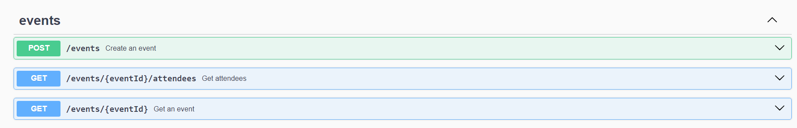
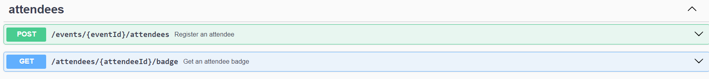

# Pass.in

Pass.in is an application for **managing participants in in-person events**.

- The tool allows the organizer to register an event and open a public registration page.
  
- Registered participants can generate a credential for check-in on the day of the event.
  
- The system will scan the participant's credential to allow entry to the event.

--- 

## Requirements

### Functional Requirements

- [x] The organizer should be able to register a new event;
- [x] The organizer should be able to view event data;
- [x] The organizer should be able to view the list of participants;
- [x] Participants should be able to register for an event;
- [x] Participants should be able to view their registration badge;
- [x] Participants should be able to check-in at the event;

---

### Business Rules

- [x] Participants can only register for an event once;
- [x] Participants can only register for events with available slots;
- [x] Participants can only check-in to an event once;

---

### Non-functional Requirements

- [x] Event check-in will be done through a QR code;

---

## API Documentation (Swagger)






---

## Database

Relational database (SQL).

### Database Structure (SQL)

```sql
-- CreateTable
CREATE TABLE "events" (
    "id" TEXT NOT NULL PRIMARY KEY,
    "title" TEXT NOT NULL,
    "details" TEXT,
    "slug" TEXT NOT NULL,
    "maximum_attendees" INTEGER
);

-- CreateTable
CREATE TABLE "attendees" (
    "id" INTEGER NOT NULL PRIMARY KEY AUTOINCREMENT,
    "name" TEXT NOT NULL,
    "email" TEXT NOT NULL,
    "event_id" TEXT NOT NULL,
    "created_at" DATETIME NOT NULL DEFAULT CURRENT_TIMESTAMP,
    CONSTRAINT "attendees_event_id_fkey" FOREIGN KEY ("event_id") REFERENCES "events" ("id") ON DELETE RESTRICT ON UPDATE CASCADE
);

-- CreateTable
CREATE TABLE "check_ins" (
    "id" INTEGER NOT NULL PRIMARY KEY AUTOINCREMENT,
    "created_at" DATETIME NOT NULL DEFAULT CURRENT_TIMESTAMP,
    "attendeeId" INTEGER NOT NULL,
    CONSTRAINT "check_ins_attendeeId_fkey" FOREIGN KEY ("attendeeId") REFERENCES "attendees" ("id") ON DELETE RESTRICT ON UPDATE CASCADE
);

-- CreateIndex
CREATE UNIQUE INDEX "events_slug_key" ON "events"("slug");

-- CreateIndex
CREATE UNIQUE INDEX "attendees_event_id_email_key" ON "attendees"("event_id", "email");

-- CreateIndex
CREATE UNIQUE INDEX "check_ins_attendeeId_key" ON "check_ins"("attendeeId");
```

---

### Usage

1. **Installing Dependencies**:

   Run the following command to install all dependencies listed in the `package.json` file:

   ```
   npm install
   ```

2. **Database Configuration**:

   If you're using Prisma to interact with the database, run the database migrations using the following command:

   ```
   npm run db:migrate
   ```

3. **Running the Development Server**:

   To start the development server, use the following command:

   ```
   npm run dev
   ```

   This will start the server using TypeScript and monitor changes in the source code, restarting the server as necessary.

4. **Viewing Prisma Studio (optional)**:

   If you wish to view Prisma Studio, a user interface for exploring and managing database data, use the following command:

   ```
   npm run db:studio
   ```

   This will open Prisma Studio in your default browser.

---

## Status


---

## ✨ Author

| [<br><sub><b>Jéssica F. Rebelo</b></sub>](https://github.com/jessrbl) |
| :---: |
