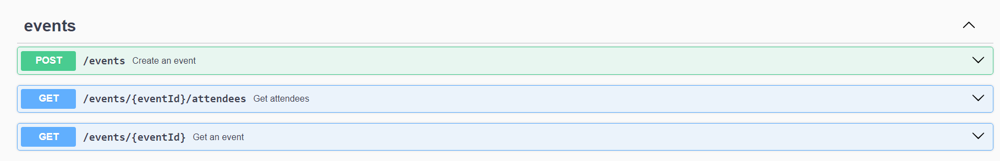
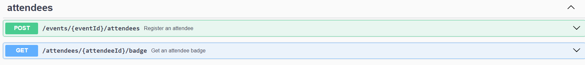
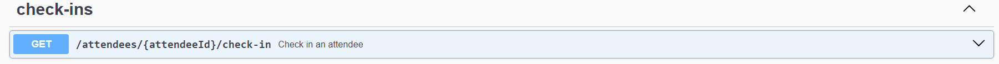

<h6> <a href = "https://github.com/jessrbl/API-PassIn/blob/main/README-EN.md"> English version </a></h6>

# Pass.in

O pass.in é uma aplicação de **gestão de participantes em eventos presenciais**. 

- A ferramenta permite que o organizador cadastre um evento e abra uma página pública de inscrição.

- Os participantes inscritos podem emitir uma credencial para check-in no dia do evento.

- O sistema fará um scan da credencial do participante para permitir a entrada no evento.

___ 

## Requisitos

### Requisitos funcionais

- [x] O organizador deve poder cadastrar um novo evento;
- [x] O organizador deve poder visualizar dados de um evento;
- [x] O organizador deve poser visualizar a lista de participantes; 
- [x] O participante deve poder se inscrever em um evento;
- [x] O participante deve poder visualizar seu crachá de inscrição;
- [x] O participante deve poder realizar check-in no evento;

___

### Regras de negócio

- [x] O participante só pode se inscrever em um evento uma única vez;
- [x] O participante só pode se inscrever em eventos com vagas disponíveis;
- [x] O participante só pode realizar check-in em um evento uma única vez;

___

### Requisitos não-funcionais

- [x] O check-in no evento será realizado através de um QRCode;

___

## Documentação da API (Swagger)







___

## Banco de dados

Banco de dados relacional (SQL). 

___

### Estrutura do banco (SQL)

```sql
-- CreateTable
CREATE TABLE "events" (
    "id" TEXT NOT NULL PRIMARY KEY,
    "title" TEXT NOT NULL,
    "details" TEXT,
    "slug" TEXT NOT NULL,
    "maximum_attendees" INTEGER
);

-- CreateTable
CREATE TABLE "attendees" (
    "id" INTEGER NOT NULL PRIMARY KEY AUTOINCREMENT,
    "name" TEXT NOT NULL,
    "email" TEXT NOT NULL,
    "event_id" TEXT NOT NULL,
    "created_at" DATETIME NOT NULL DEFAULT CURRENT_TIMESTAMP,
    CONSTRAINT "attendees_event_id_fkey" FOREIGN KEY ("event_id") REFERENCES "events" ("id") ON DELETE RESTRICT ON UPDATE CASCADE
);

-- CreateTable
CREATE TABLE "check_ins" (
    "id" INTEGER NOT NULL PRIMARY KEY AUTOINCREMENT,
    "created_at" DATETIME NOT NULL DEFAULT CURRENT_TIMESTAMP,
    "attendeeId" INTEGER NOT NULL,
    CONSTRAINT "check_ins_attendeeId_fkey" FOREIGN KEY ("attendeeId") REFERENCES "attendees" ("id") ON DELETE RESTRICT ON UPDATE CASCADE
);

-- CreateIndex
CREATE UNIQUE INDEX "events_slug_key" ON "events"("slug");

-- CreateIndex
CREATE UNIQUE INDEX "attendees_event_id_email_key" ON "attendees"("event_id", "email");

-- CreateIndex
CREATE UNIQUE INDEX "check_ins_attendeeId_key" ON "check_ins"("attendeeId");
```

___

### Utilização

1. **Instalação de Dependências**:

   Execute o seguinte comando para instalar todas as dependências listadas no arquivo `package.json`:

   ```
   npm install
   ```

2. **Configuração do Banco de Dados**:

   Se estiver usando o Prisma para interagir com o banco de dados, execute as migrações do banco de dados usando o seguinte comando:

   ```
   npm run db:migrate
   ```

3. **Execução do Servidor de Desenvolvimento**:

   Para iniciar o servidor de desenvolvimento, utilize o seguinte comando:

   ```
   npm run dev
   ```

   Isso iniciará o servidor usando o TypeScript e monitorará as alterações no código fonte, reiniciando o servidor conforme necessário.


4. **Visualização do Prisma Studio (opcional)**:

   Se desejar visualizar o Prisma Studio, uma interface de usuário para explorar e gerenciar os dados do banco de dados, utilize o seguinte comando:

   ```
   npm run db:studio
   ```

   Isso abrirá o Prisma Studio no seu navegador padrão.

___

## Status


___

<h2> ✨ Autor</h2>

<table>
  <tr>
    <td align="center">
      <a href="https://github.com/jessrbl">
        <br>
        <sub>
          <b>Jéssica F. Rebelo</b>
        </sub>
      </a>
    </td>
  </tr>
</table>
